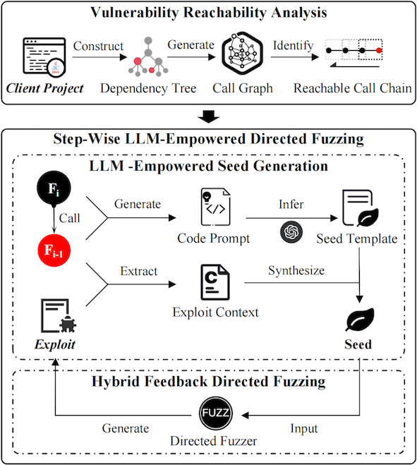

# Magneto: Exploit Vulnerabilities in Dependent Libraries

Magneto is a **Step-Wise** tool designed to exploit vulnerabilities in dependent libraries of client projects. It breaks down the fuzzing process for an entire call chain—from the client project to the vulnerable function—into a series of **LLM-empowered** directed fuzzing tasks executed within the reachable call chain. This decomposition simplifies the overall exploit generation task. Our approach surpasses the state-of-the-art.

## Overview
<p style="text-align: center;">
    
</p>


Here's how Magneto works:

1. **Vulnerability Reachability Analysis**: Magneto performs vulnerability reachability analysis to identify all call chains that statically reach the vulnerable function.

2. **Step-wise Directed Fuzzing**:
    - For each step in the call chain (represented as a pair $\langle F_i, F_{i-1} \rangle$, where $F_i$ calls $F_{i-1}$), Magneto conducts LLM-empowered directed fuzzing in the reachable call chain (starting from the library's vulnerable function).
    - During this process, Magneto generates an initial seed based on the LLM's semantic understanding of $F_i$ and the exploit generated in the previous step.
    - With this seed, Magneto employs heuristic-directed fuzzing to generate the exploit of $F_i$.

**Benefits**:
- Developers can adopt Magneto to discover exploitable vulnerabilities in their project dependencies.
- Provides reachable call chains and exploits as confident evidence.
- Helps quickly mitigate security risks in dependencies.


## Getting Started
### File Structure
- `assets` folder contains resource files related to README.md.
- `Magneto` folder contains the source code of our tool.
- `Evaluation_Data` folder contains our experimental data and code.

### Requirements
- Java version: 1.8
- Apache Maven 3.8.8

### Usage
First, edit the `Magneto/magneto-engine/src/main/resources/application.properties` configuration file to update the `gpt.access-token` and `config.ground-truth-path` settings. The `gpt.access-token` is the token required for using the OpenAI API, and `config.ground-truth-path` specifies the absolute path to the `Magneto/groundtruth` folder.

Next, we need to compile and package the source code.
```shell
cd Magneto/         # Enter the directory containing the source code.
mvn clean package   # Compile and package
```
Then, we will obtain an executable JAR file in `magneto-engine/target/magneto-engine-1.0.jar`


Here, we introduce how to use the JAR file to analyze the client project
```commandline
usage: java -jar -noverify magneto-engine-1.0.jar [-p [PROJECT_PATH]] [-output [OUTPUT_DIR]] 
[-skipFuzz] [-vul [VUL_NAME]]

optional arguments:
  -p [PROJECT_PATH]         The path of the client project to be analyzed
  -output [OUTPUT_DIR]      The output path of the tool
  -skipFuzz                 Skip fuzzing, only perform vulnerability reachability analysis
  -vul [VUL_NAME]           Specify the vulnerability name to be analyzed by the tool
```
Note: If `[PROJECT_PATH]` is not specified, the tool defaults to analyzing the demo project(i.e., `Magneto/test-tool-demo`). If `[OUTPUT_DIR]` is not specified, the tool saves the results to the `output` folder. By default, the tool does not skip the fuzzing phase. If `[VUL_NAME]` is not specified, the tool analyzes all vulnerabilities in the vulnerability database.

If you encounter any other issues, please do not hesitate to contact us.
